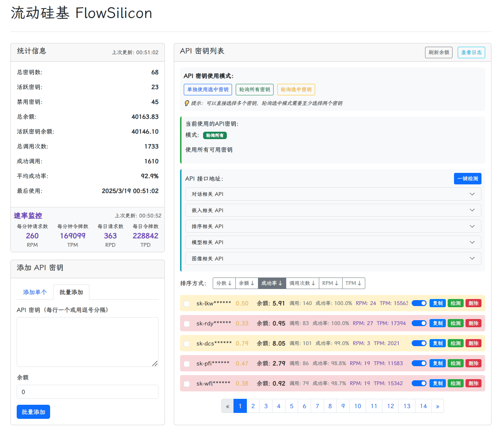
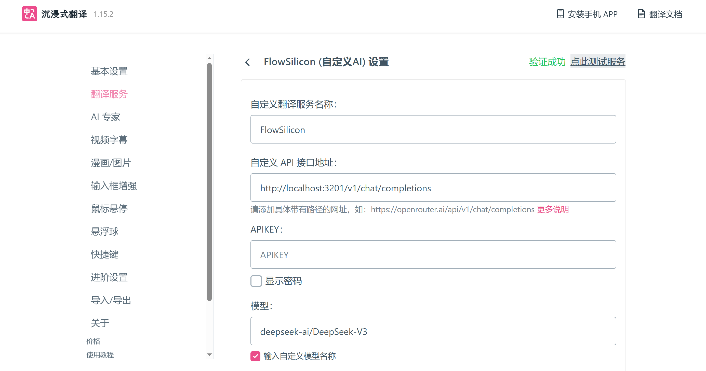
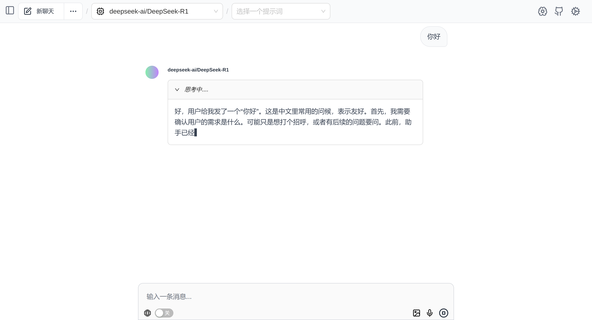
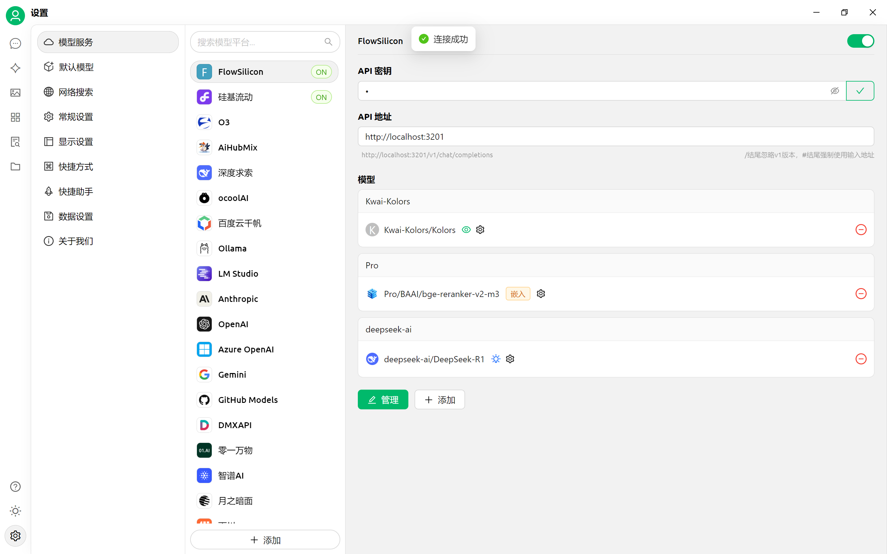

# FlowSilicon

<p align="center">
  
  
  
</p>
FlowSilicon 是一个专为硅基流动 API 设计的高性能代理服务，提供全面的 API 密钥管理、智能负载均衡、请求转发和实时监控功能。通过 FlowSilicon，您可以更高效地管理和使用硅基流动的各种 AI 服务，同时获得直观友好的 Web 管理界面。


## 截图



### 沉浸式翻译



### Page Assist



### Cherry Studio




## ✨ 核心功能

### 🔑 API 密钥管理

FlowSilicon 提供全面的 API 密钥管理功能：

- **多种添加方式**：支持单个添加和批量添加 API 密钥
- **自动余额检测**：自动检测 API 密钥余额，无需手动输入
- **本地安全存储**：所有 API 密钥安全存储在本地，不会上传到任何第三方服务
- **智能密钥轮询**：支持三种 API 密钥使用模式（单独使用、全部轮询、选中轮询）
- **多维度智能排序**：根据余额(40%)、成功率(30%)、RPM(15%)和TPM(15%)的加权评分自动排序 API 密钥
- **自动故障处理**：连续失败超过阈值的 API 密钥会被自动禁用，并定期尝试恢复
- **手动控制**：支持手动启用或禁用特定的 API 密钥，灵活应对各种场景

### 🔄 请求代理与转发

- **完全兼容 OpenAI API**：无缝支持 OpenAI 格式的 API 请求，无需修改现有代码
- **高级流式处理**：完整支持 OpenAI 的流式响应（SSE）处理，实现实时交互体验
- **自适应延迟算法**：根据内容大小和生成速度动态调整响应速率，优化用户体验
- **多种响应处理模式**：支持字符逐个发送或批量发送，适应不同应用场景
- **智能 JSON 处理**：自动处理请求和响应中的 JSON 格式，确保数据完整性
- **原生 SSE 兼容**：保留原始 SSE 事件格式，确保与各种客户端库完全兼容

### 📊 性能监控与统计

- **实时请求速率监控**：直观显示每分钟请求数（RPM）和每分钟令牌数（TPM）
- **密钥使用统计**：详细记录每个 API 密钥的调用次数、成功率等关键指标
- **余额监控**：定时检测 API 密钥余额，自动处理低余额和零余额密钥
- **日志查看**：提供便捷的日志查看功能，快速定位和排查问题
- **资源使用分析**：分析并展示 API 资源使用情况，帮助优化成本


## 🚀 安装与使用

### 📥 直接下载

1. 从 [Releases](https://github.com/HanHai-Space/FlowSilicon/releases) or [蓝奏云](https://wwzk.lanzouo.com/iKvsW2quztha) 页面下载最新版本的可执行文件
2. 解压后直接运行 `flowsilicon.exe`（Windows）

### 📥 从源码构建

```bash
# 克隆仓库
git https://github.com/HanHai-Space/FlowSilicon.git
cd flowsilicon

# 构建
go build -o flowsilicon cmd/flowsilicon/main.go

# 运行
./flowsilicon
```

## ⚙️ 配置说明

FlowSilicon 使用 YAML 格式的配置文件 `config/config.yaml`，支持以下配置项：

```yaml
# API代理配置
api_proxy:
    # API基础URL，用于转发请求
    base_url: https://api.siliconflow.cn
    # 检查API密钥余额的间隔时间（分钟）
    check_interval: 60

# 服务器配置
server:
    # 日志保留时间（分钟），超过此时间的日志将被清理
    log_retention_minutes: 10
    # 服务器监听端口
    port: 3201

# 应用程序配置
app:
    # 应用程序标题，显示在Web界面上
    title: "API 密钥管理系统"
    # 最低余额阈值，低于此值的API密钥将被自动禁用
    min_balance_threshold: 1.8
    # 余额显示的最大值，用于前端显示进度条
    max_balance_display: 14
    # 每页显示的密钥数量
    items_per_page: 5
    # 最大统计条目数，用于限制请求统计的历史记录数量
    max_stats_entries: 60
    # 恢复检查间隔（分钟），系统会每隔此时间尝试恢复被禁用的密钥
    recovery_interval: 10
    # 最大连续失败次数，超过此值的密钥将被自动禁用
    max_consecutive_failures: 5
    
    # 权重配置
    balance_weight: 0.4     # 余额评分权重（默认0.4，即40%）
    success_rate_weight: 0.3 # 成功率评分权重（默认0.3，即30%）
    rpm_weight: 0.15        # RPM评分权重（默认0.15，即15%）
    tpm_weight: 0.15        # TPM评分权重（默认0.15，即15%）
    
    # 模型特定的密钥选择策略
    # 策略ID: 1=高成功率, 2=高分数, 3=低RPM, 4=低TPM, 5=高余额
    model_key_strategies:
      "deepseek-ai/DeepSeek-V3": 1  # 使用高成功率策略

# 日志配置
log:
    # 日志文件最大大小（MB），超过此大小将自动清理
    max_size_mb: 10
```


## 📄 许可证

FlowSilicon 使用 [MIT 许可证](LICENSE)。 