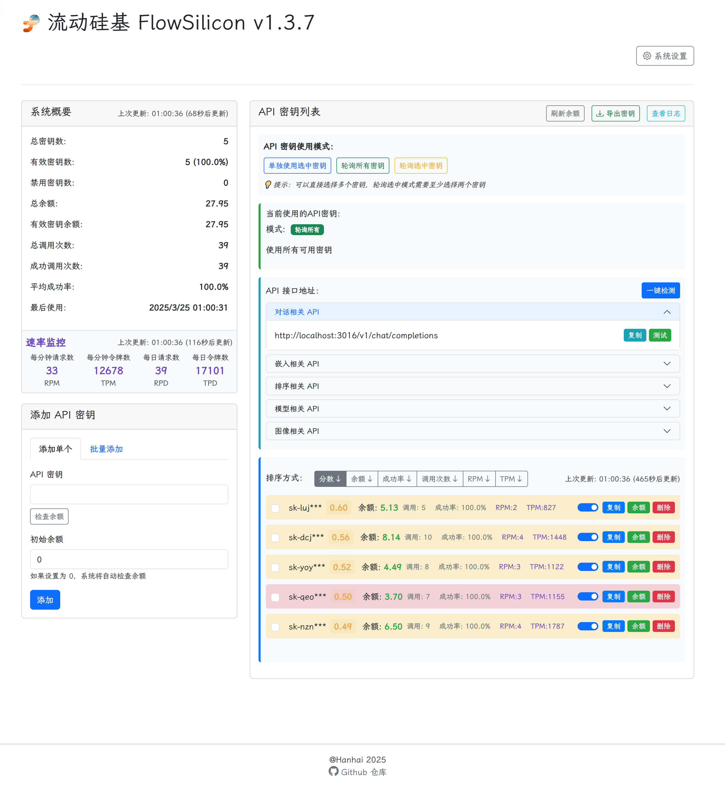
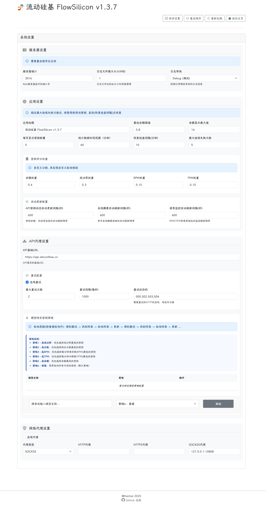
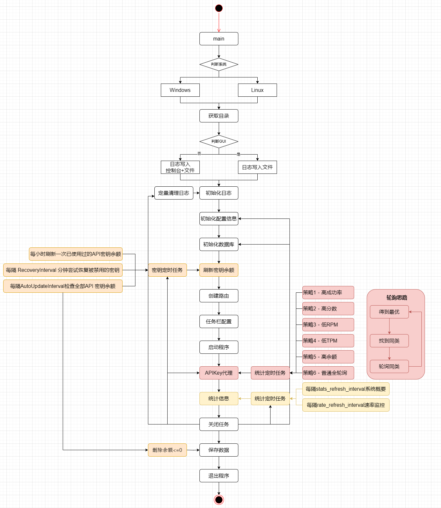

#  FlowSilicon

<p align="center">
  
  
  
</p>


> [!note]
>
> 1. 功能已经基本实现, 代码还在整理和优化
> 2. 目前v1.3.7只有Windows版本


## 截图






### 沉浸式翻译

> [!note]
>
> + 建议设置
>   + 每秒最大请求数：20
>   + 每次请求最大文本长度: 1500
>   + 每次请求最大段落数：50


### Page Assist


### Cherry Studio


### 逻辑与架构

+ **Go + Gin + SQLite**
+ 如下图




## ✨ 核心功能

### 🔑 API 密钥管理

FlowSilicon 提供全面的 API 密钥管理功能：

- **多种添加方式**：支持单个添加和批量添加 API 密钥
- **自动余额检测**：自动检测 API 密钥余额，无需手动输入
- **本地安全存储**：所有 API 密钥安全存储在本地，不会上传到任何第三方服务
- **智能密钥轮询**：支持三种 API 密钥使用模式（单独使用、全部轮询、选中轮询）
- **多维度智能排序**：根据余额(40%)、成功率(30%)、RPM(15%)和 TPM(15%)的加权评分自动排序 API 密钥
- **自动故障处理**：连续失败超过阈值的 API 密钥会被自动禁用，并定期尝试恢复
- **模型特定策略**：针对不同模型可设置不同的密钥选择策略（高成功率、高分数、低 RPM、低 TPM、高余额）

### 🔄 请求代理与转发

- **智能重试机制**：可配置的重试策略，对网络错误和特定状态码自动重试
- **高级流式处理**：完整支持 OpenAI 的流式响应（SSE）处理，实现实时交互体验
- **自适应延迟算法**：根据内容大小和生成速度动态调整响应速率，优化用户体验

### 📊 性能监控与统计

- **实时请求速率监控**：直观显示每分钟请求数（RPM）和每分钟令牌数（TPM）
- **密钥使用统计**：详细记录每个 API 密钥的调用次数、成功率等关键指标
- **余额监控**：定时检测 API 密钥余额，自动处理低余额和零余额密钥
- **日志查看**：提供便捷的日志查看功能，快速定位和排查问题
- **资源使用分析**：分析并展示 API 资源使用情况，帮助优化成本

### 🌐 系统集成与易用性

- **系统托盘集成**：支持在系统托盘中运行，节省桌面空间
- **自启动支持**：可配置为系统启动时自动运行
- **代理支持**：支持 HTTP、HTTPS 和 SOCKS5 代理，解决网络访问问题
- **直观的 Web 界面**：友好的用户界面，简化管理操作
- **自动更新刷新**：配置灵活的自动刷新间隔，保持数据实时性


## 🚀 安装与使用

### 📥 直接下载

1. 从 [蓝奏云](https://hanhaii.lanzouo.com/b00ya2hfte) <u>密码:ggha</u>  or [Releases](https://github.com/HanHai-Space/FlowSilicon/releases) 页面下载最新版本的可执行文件
2. 解压缩下载的压缩包
3. 双击运行 `flowsilicon.exe`
4. 系统将自动打开浏览器访问管理界面（默认地址：http://localhost: 3016）

> [!note]
>
> 会自动缩小的任务栏


### 📥 从源码构建

```bash
# 克隆仓库
git https://github.com/HanHai-Space/FlowSilicon.git
cd flowsilicon

# 构建
go build -o flowsilicon cmd/flowsilicon/main_windows.go

# 运行
./flowsilicon
```


## 📈 更新日志

请查看 [CHANGELOG.md](CHANGELOG.md) 获取完整的更新记录。


## 📄 许可证

FlowSilicon 使用 [Apache--2.0 许可证](LICENSE)。 